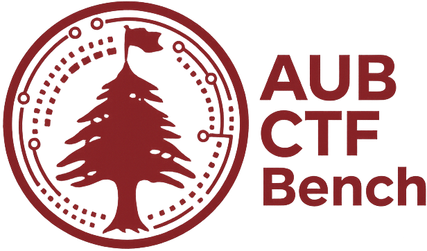

# AUB-CTF-Bench: The Vision Gap

<div align="center">
  
</div>

<p align="center">
  A comprehensive platform for benchmarking Large Language Models (LLMs) on multi-modal Capture The Flag (CTF) challenges.
</p>

---

AUB-CTF-Bench is a research-focused web application built with Streamlit to provide a robust environment for evaluating the capabilities of modern AI models in solving complex, multi-modal cybersecurity problems. It features a rich user interface for managing models, creating benchmarks, comparing results, and analyzing performance.

> **Note on Data:** The data presented in this frontend is for demonstration purposes only and serves to illustrate the vision of the thesis research. The complete and real datasets will be published soon.

## 🛠️ Tech Stack

- **Frontend**: [Streamlit](https://streamlit.io/)
- **Data Manipulation**: [Pandas](https://pandas.pydata.org/), [NumPy](https://numpy.org/)
- **Plotting**: [Plotly](https://plotly.com/python/)
- **Icons**: [Font Awesome](https://fontawesome.com/)

## 🚀 Getting Started

Follow these instructions to get a copy of the project up and running on your local machine for development and testing purposes.

### Prerequisites

- Python 3.8+
- `pip` for package management

### Installation

1.  Clone the repository to your local machine:
    ```bash
    git clone https://github.com/RaphaelFakhri/AUB-CTF-Bench.git
    cd AUB-CTF-Bench
    ```

2.  Create and activate a virtual environment (recommended):
    ```bash
    python -m venv venv
    source venv/bin/activate  # On Windows use `venv\Scripts\activate`
    ```

3.  Install the required dependencies:
    ```bash
    pip install -r requirements.txt
    ```

### Running the Application

Once the dependencies are installed, you can run the Streamlit application with the following command:

```bash
streamlit run main.py
```

The application will be accessible in your web browser at `http://localhost:8501`.

## 📂 Project Structure

```
.
├── assets/             # Static assets like logos and images
├── src/                # Main source code
│   ├── views/          # UI components for each page/section
│   ├── data.py         # Mock data generation
│   └── utils.py        # Utility functions
├── main.py             # Main Streamlit application entrypoint
├── requirements.txt    # Project dependencies
└── README.md           # This file
```
